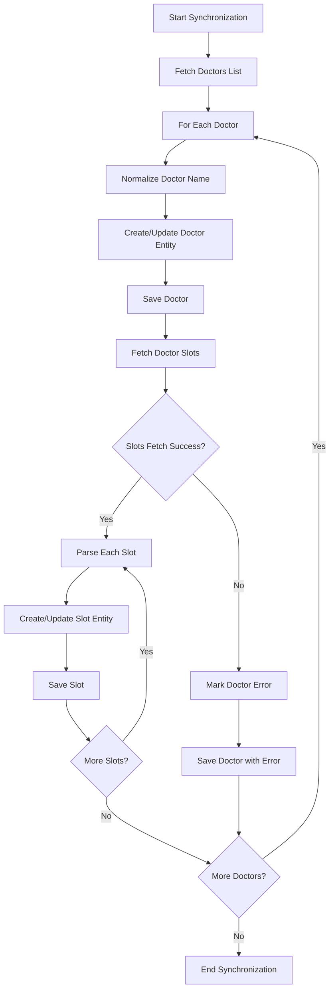

# Source Module - Agent Context

> **Parent**: [Root AGENTS.md](../AGENTS.md)
> **Purpose**: Core synchronization logic and implementation patterns
> **Module Path**: `src/`

## Module Responsibility

The Source module contains the core business logic for synchronizing doctor appointment slots from external APIs to the local database. It currently implements a monolithic approach that needs refactoring into clean, maintainable components.

## Current Implementation

### DoctorSlotsSynchronizer

**Location**: `DoctorSlotsSynchronizer.php`

**Purpose**: Main synchronization orchestrator (currently handles everything)

**Current Responsibilities** (violation of SRP):
1. HTTP client for external API calls
2. Authentication handling
3. JSON parsing and validation
4. Business logic processing
5. Database persistence
6. Error handling and logging
7. Name normalization

**Key Methods**:
- `synchronizeDoctorSlots()`: Main orchestration method
- `getDoctors()`: Fetch doctors list from API
- `fetchDoctorSlots()`: Fetch slots for specific doctor
- `normalizeName()`: Handle name formatting rules
- `parseSlots()`: Convert API data to entities
- `save()`: Persist entities to database

### StaticDoctorSlotsSynchronizer

**Location**: `StaticDoctorSlotsSynchronizer.php`

**Purpose**: Test/development data source (extends main synchronizer)

**Implementation**: Overrides `getDoctors()` to return static JSON data instead of API call

**Usage**: Allows testing without external API dependency

## Business Logic Analysis

### Synchronization Flow



### Business Rules

#### 1. Doctor Name Normalization

**Rule**: Special handling for Irish surnames
```php
protected function normalizeName(string $fullName): string
{
    [, $surname] = explode(' ', $fullName);
    
    if (0 === stripos($surname, "o'")) {
        return ucwords($fullName, ' \'');  // O'Connor -> O'Connor
    }
    
    return ucwords($fullName);  // john doe -> John Doe
}
```

**Business Context**: Proper name capitalization for professional display

#### 2. Slot Staleness Check

**Rule**: Slots older than 5 minutes are considered "stale" and can be updated
```php
public function isStale(): bool
{
    return $this->createdAt < new DateTime('5 minutes ago');
}
```

**Business Context**: Prevents overwriting recent slot changes

#### 3. Error Reporting Schedule

**Rule**: Don't report errors on Sundays
```php
protected function shouldReportErrors(): bool
{
    return (new DateTime())->format('D') !== 'Sun';
}
```

**Business Context**: Reduce noise during off-business hours

#### 4. Slot Update Logic

**Rule**: Only update existing slots if they are stale
```php
if ($entity->isStale()) {
    $entity->setEnd($end);  // Update end time only
}
```

**Business Context**: Preserve recent manual changes

### Authentication & Configuration

**Current Implementation**:
```php
protected const ENDPOINT = 'http://localhost:2137/api/doctors';
protected const USERNAME = 'docplanner';
protected const PASSWORD = 'docplanner';
```

**Issues**:
- Hardcoded credentials (security risk)
- Hardcoded endpoint (inflexible)
- Basic auth embedded in code (not configurable)

## Architectural Issues

### Single Responsibility Principle Violations

**Problem**: One class doing everything
```php
class DoctorSlotsSynchronizer
{
    // HTTP concerns
    protected function fetchData(string $url): string|false

    // Business logic concerns  
    protected function normalizeName(string $fullName): string
    
    // Persistence concerns
    protected function save(Doctor|Slot $entity): void
    
    // Logging concerns
    protected Logger $logger;
}
```

### Tight Coupling Issues

**Problem**: Direct dependencies on concrete classes
```php
public function __construct(EntityManagerInterface $em, string $logFile = 'php://stderr')
{
    $this->repository = $em->getRepository(Doctor::class);  // Tight coupling to Doctrine
    $this->slots = $em->getRepository(Slot::class);
    $this->logger = new Logger('logger', [new StreamHandler($logFile)]); // Tight coupling to Monolog
}
```

### Error Handling Issues

**Problem**: Generic exception catching loses context
```php
try {
    $slots = $this->getJsonDecode($this->getSlots($id));
    yield from $this->parseSlots($slots, $id);
} catch (JsonException) {  // Too generic
    if ($this->shouldReportErrors()) {
        $this->logger->info('Error fetching slots for doctor', ['doctorId' => $id]);
    }
    yield false;  // Unclear what false means
}
```

### Testability Issues

**Problem**: Hard to test due to coupling
```php
// Hard to mock file_get_contents
protected function fetchData(string $url): string|false
{
    return @file_get_contents(
        filename: $url,
        context: stream_context_create([...])
    );
}

// Hard to test database operations
protected function save(Doctor|Slot $entity): void
{
    $em = $this->repository->createQueryBuilder('alias')->getEntityManager();
    $em->persist($entity);
    $em->flush();
}
```

## Refactoring Strategy

### Target Architecture

```
DoctorSynchronizationService (Application Layer)
├── DoctorApiClientInterface (Infrastructure)
│   ├── HttpDoctorApiClient
│   └── StaticDoctorApiClient
├── DoctorRepositoryInterface (Domain)
├── SlotRepositoryInterface (Domain)
├── NameNormalizationService (Domain)
└── ErrorReportingService (Domain)
```

### Extracted Services

#### 1. DoctorApiClientInterface

**Purpose**: Handle external API communication

```php
interface DoctorApiClientInterface
{
    public function getDoctors(): array;
    public function getDoctorSlots(int $doctorId): array;
}

class HttpDoctorApiClient implements DoctorApiClientInterface
{
    public function __construct(
        private HttpClientInterface $httpClient,
        private string $baseUrl,
        private array $credentials,
    ) {}
    
    public function getDoctors(): array
    {
        $response = $this->httpClient->get($this->baseUrl . '/doctors', [
            'auth' => [$this->credentials['username'], $this->credentials['password']],
        ]);
        
        return $this->parseJsonResponse($response);
    }
}

class StaticDoctorApiClient implements DoctorApiClientInterface
{
    public function getDoctors(): array
    {
        return json_decode('[{"id": 0, "name": "Adoring Shtern"}, ...]', true);
    }
    
    public function getDoctorSlots(int $doctorId): array
    {
        // Return mock slot data
        return [];
    }
}
```

#### 2. NameNormalizationService

**Purpose**: Handle business rules for name formatting

```php
class NameNormalizationService
{
    public function normalize(string $fullName): string
    {
        $this->validateName($fullName);
        
        [, $surname] = explode(' ', $fullName, 2);
        
        if ($this->isIrishSurname($surname)) {
            return ucwords($fullName, ' \'');
        }
        
        return ucwords($fullName);
    }
    
    private function isIrishSurname(string $surname): bool
    {
        return 0 === stripos($surname, "o'");
    }
    
    private function validateName(string $name): void
    {
        if (empty(trim($name))) {
            throw new InvalidNameException('Name cannot be empty');
        }
        
        if (substr_count($name, ' ') < 1) {
            throw new InvalidNameException('Full name must contain first and last name');
        }
    }
}
```

#### 3. DoctorSynchronizationService

**Purpose**: Orchestrate the synchronization process

```php
class DoctorSynchronizationService
{
    public function __construct(
        private DoctorApiClientInterface $apiClient,
        private DoctorRepositoryInterface $doctorRepository,
        private SlotRepositoryInterface $slotRepository,
        private NameNormalizationService $nameNormalizer,
        private ErrorReportingService $errorReporter,
        private LoggerInterface $logger,
    ) {}
    
    public function synchronize(): SynchronizationResult
    {
        $result = new SynchronizationResult();
        
        try {
            $doctors = $this->apiClient->getDoctors();
            
            foreach ($doctors as $doctorData) {
                $this->synchronizeDoctor($doctorData, $result);
            }
        } catch (ApiConnectionException $e) {
            $this->logger->error('Failed to fetch doctors', ['exception' => $e]);
            $result->addError('API connection failed');
        }
        
        return $result;
    }
    
    private function synchronizeDoctor(array $doctorData, SynchronizationResult $result): void
    {
        try {
            $doctor = $this->createOrUpdateDoctor($doctorData);
            $this->synchronizeDoctorSlots($doctor, $result);
            
            $result->addSuccess($doctor->getId());
        } catch (DoctorSynchronizationException $e) {
            $this->handleDoctorError($doctorData, $e, $result);
        }
    }
    
    private function createOrUpdateDoctor(array $data): Doctor
    {
        $id = new DoctorId((string)$data['id']);
        $normalizedName = $this->nameNormalizer->normalize($data['name']);
        
        $doctor = $this->doctorRepository->findById($id)
            ?? new Doctor($id, new DoctorName($normalizedName));
            
        $doctor->updateName(new DoctorName($normalizedName));
        $doctor->clearError();
        
        $this->doctorRepository->save($doctor);
        
        return $doctor;
    }
}
```

#### 4. ErrorReportingService

**Purpose**: Handle error reporting business rules

```php
class ErrorReportingService
{
    public function shouldReportError(): bool
    {
        return !$this->isSunday();
    }
    
    public function reportError(string $message, array $context = []): void
    {
        if (!$this->shouldReportError()) {
            return;
        }
        
        $this->logger->error($message, $context);
    }
    
    private function isSunday(): bool
    {
        return (new DateTime())->format('D') === 'Sun';
    }
}
```

## Testing Strategy

### Unit Tests

**DoctorSynchronizationServiceTest.php**:
```php
class DoctorSynchronizationServiceTest extends TestCase
{
    private DoctorApiClientInterface $apiClient;
    private DoctorRepositoryInterface $doctorRepository;
    private SlotRepositoryInterface $slotRepository;
    private NameNormalizationService $nameNormalizer;
    private DoctorSynchronizationService $service;
    
    protected function setUp(): void
    {
        $this->apiClient = $this->createMock(DoctorApiClientInterface::class);
        $this->doctorRepository = $this->createMock(DoctorRepositoryInterface::class);
        $this->slotRepository = $this->createMock(SlotRepositoryInterface::class);
        $this->nameNormalizer = $this->createMock(NameNormalizationService::class);
        
        $this->service = new DoctorSynchronizationService(
            $this->apiClient,
            $this->doctorRepository,
            $this->slotRepository,
            $this->nameNormalizer,
            $this->createMock(ErrorReportingService::class),
            $this->createMock(LoggerInterface::class),
        );
    }
    
    public function testSynchronizeSuccessfully(): void
    {
        // Arrange
        $doctorsData = [['id' => 1, 'name' => 'john doe']];
        $this->apiClient->expects($this->once())
            ->method('getDoctors')
            ->willReturn($doctorsData);
            
        $this->nameNormalizer->expects($this->once())
            ->method('normalize')
            ->with('john doe')
            ->willReturn('John Doe');
        
        // Act
        $result = $this->service->synchronize();
        
        // Assert
        $this->assertTrue($result->isSuccessful());
        $this->assertCount(1, $result->getSuccessfulDoctors());
    }
}
```

**NameNormalizationServiceTest.php**:
```php
class NameNormalizationServiceTest extends TestCase
{
    private NameNormalizationService $service;
    
    protected function setUp(): void
    {
        $this->service = new NameNormalizationService();
    }
    
    /**
     * @dataProvider nameProvider
     */
    public function testNormalizeName(string $input, string $expected): void
    {
        $result = $this->service->normalize($input);
        
        $this->assertEquals($expected, $result);
    }
    
    public static function nameProvider(): array
    {
        return [
            ['john doe', 'John Doe'],
            ['JANE SMITH', 'Jane Smith'],
            ["mary o'connor", "Mary O'Connor"],
            ["patrick o'brien", "Patrick O'Brien"],
        ];
    }
    
    public function testThrowsExceptionForEmptyName(): void
    {
        $this->expectException(InvalidNameException::class);
        
        $this->service->normalize('');
    }
    
    public function testThrowsExceptionForSingleName(): void
    {
        $this->expectException(InvalidNameException::class);
        
        $this->service->normalize('John');
    }
}
```

### Integration Tests

**HttpDoctorApiClientTest.php**:
```php
class HttpDoctorApiClientTest extends TestCase
{
    private HttpClientInterface $httpClient;
    private HttpDoctorApiClient $client;
    
    protected function setUp(): void
    {
        $this->httpClient = $this->createMock(HttpClientInterface::class);
        $this->client = new HttpDoctorApiClient(
            $this->httpClient,
            'http://api.example.com',
            ['username' => 'test', 'password' => 'test']
        );
    }
    
    public function testGetDoctorsSuccessfully(): void
    {
        // Arrange
        $responseData = [['id' => 1, 'name' => 'John Doe']];
        $response = $this->createMock(ResponseInterface::class);
        $response->method('getBody')->willReturn(json_encode($responseData));
        
        $this->httpClient->expects($this->once())
            ->method('get')
            ->with('http://api.example.com/doctors')
            ->willReturn($response);
        
        // Act
        $result = $this->client->getDoctors();
        
        // Assert
        $this->assertEquals($responseData, $result);
    }
}
```

## Performance Considerations

### Current Issues

1. **N+1 Query Problem**: Individual API calls for each doctor's slots
2. **No Batching**: Each entity saved individually
3. **No Caching**: Same data fetched repeatedly
4. **Blocking Operations**: Synchronous processing

### Optimization Strategies

#### 1. Batch Processing

```php
class BatchDoctorSynchronizationService
{
    private const BATCH_SIZE = 50;
    
    public function synchronize(): SynchronizationResult
    {
        $doctors = $this->apiClient->getDoctors();
        $batches = array_chunk($doctors, self::BATCH_SIZE);
        
        foreach ($batches as $batch) {
            $this->processBatch($batch);
        }
    }
    
    private function processBatch(array $batch): void
    {
        $this->entityManager->beginTransaction();
        
        try {
            foreach ($batch as $doctorData) {
                $this->processDoctor($doctorData);
            }
            
            $this->entityManager->flush();
            $this->entityManager->commit();
        } catch (Exception $e) {
            $this->entityManager->rollback();
            throw $e;
        }
    }
}
```

#### 2. Caching Layer

```php
class CachedDoctorApiClient implements DoctorApiClientInterface
{
    public function __construct(
        private DoctorApiClientInterface $client,
        private CacheInterface $cache,
    ) {}
    
    public function getDoctors(): array
    {
        return $this->cache->get('doctors_list', function() {
            return $this->client->getDoctors();
        }, ttl: 300); // 5 minutes
    }
}
```

#### 3. Async Processing

```php
class AsyncDoctorSynchronizationService
{
    public function synchronizeAsync(): void
    {
        $doctors = $this->apiClient->getDoctors();
        
        foreach ($doctors as $doctorData) {
            $this->messageBus->dispatch(
                new SynchronizeDoctorCommand($doctorData)
            );
        }
    }
}
```

## Configuration Management

### Environment-Based Configuration

```php
class SynchronizationConfig
{
    public function __construct(
        private string $apiBaseUrl,
        private string $apiUsername,
        private string $apiPassword,
        private int $batchSize = 50,
        private int $retryAttempts = 3,
        private bool $enableErrorReporting = true,
    ) {}
    
    public static function fromEnvironment(): self
    {
        return new self(
            apiBaseUrl: $_ENV['DOCTOR_API_URL'] ?? 'http://localhost:2137',
            apiUsername: $_ENV['DOCTOR_API_USERNAME'] ?? throw new ConfigurationException('Missing API_USERNAME'),
            apiPassword: $_ENV['DOCTOR_API_PASSWORD'] ?? throw new ConfigurationException('Missing API_PASSWORD'),
            batchSize: (int)($_ENV['SYNC_BATCH_SIZE'] ?? 50),
            retryAttempts: (int)($_ENV['SYNC_RETRY_ATTEMPTS'] ?? 3),
            enableErrorReporting: filter_var($_ENV['ENABLE_ERROR_REPORTING'] ?? 'true', FILTER_VALIDATE_BOOLEAN),
        );
    }
}
```

## Error Handling Strategy

### Exception Hierarchy

```php
abstract class SynchronizationException extends Exception {}

class ApiConnectionException extends SynchronizationException {}
class InvalidApiResponseException extends SynchronizationException {}
class DoctorSynchronizationException extends SynchronizationException {}
class SlotSynchronizationException extends SynchronizationException {}
class ConfigurationException extends SynchronizationException {}
```

### Retry Mechanism

```php
class RetryableDoctorApiClient implements DoctorApiClientInterface
{
    public function __construct(
        private DoctorApiClientInterface $client,
        private int $maxRetries = 3,
        private int $baseDelay = 1000, // milliseconds
    ) {}
    
    public function getDoctors(): array
    {
        return $this->executeWithRetry(
            fn() => $this->client->getDoctors()
        );
    }
    
    private function executeWithRetry(callable $operation): mixed
    {
        $attempt = 0;
        
        while ($attempt < $this->maxRetries) {
            try {
                return $operation();
            } catch (ApiConnectionException $e) {
                $attempt++;
                
                if ($attempt >= $this->maxRetries) {
                    throw $e;
                }
                
                $delay = $this->baseDelay * (2 ** $attempt); // Exponential backoff
                usleep($delay * 1000);
            }
        }
    }
}
```

## Console Commands

### Synchronization Command

```php
class SynchronizeDoctorsCommand extends Command
{
    protected static $defaultName = 'doctors:synchronize';
    
    public function __construct(
        private DoctorSynchronizationService $synchronizer,
    ) {
        parent::__construct();
    }
    
    protected function configure(): void
    {
        $this
            ->setDescription('Synchronize doctors and their slots from external API')
            ->addOption('batch-size', 'b', InputOption::VALUE_OPTIONAL, 'Batch size', 50)
            ->addOption('dry-run', null, InputOption::VALUE_NONE, 'Show what would be synchronized');
    }
    
    protected function execute(InputInterface $input, OutputInterface $output): int
    {
        $io = new SymfonyStyle($input, $output);
        
        try {
            $result = $this->synchronizer->synchronize();
            
            $io->success(sprintf(
                'Synchronized %d doctors successfully, %d errors',
                count($result->getSuccessfulDoctors()),
                count($result->getErrors())
            ));
            
            return Command::SUCCESS;
        } catch (Exception $e) {
            $io->error('Synchronization failed: ' . $e->getMessage());
            return Command::FAILURE;
        }
    }
}
```

## Migration Path

### Step-by-Step Refactoring

1. **Extract Interfaces** (no behavior change)
2. **Extract Services** (one at a time)
3. **Add Dependency Injection** (constructor injection)
4. **Add Unit Tests** (for each extracted service)
5. **Extract Configuration** (environment variables)
6. **Add Error Handling** (proper exceptions)
7. **Add Performance Optimizations** (batching, caching)

### Backward Compatibility

```php
// Deprecated wrapper for existing code
class LegacyDoctorSlotsSynchronizer extends DoctorSlotsSynchronizer
{
    public function synchronizeDoctorSlots(): void
    {
        trigger_error(
            'LegacyDoctorSlotsSynchronizer is deprecated, use DoctorSynchronizationService instead',
            E_USER_DEPRECATED
        );
        
        parent::synchronizeDoctorSlots();
    }
}
```

## Navigation

- **⬆️ Back to**: [Root AGENTS.md](../AGENTS.md)
- **➡️ Related**: [Entity Module](Entity/AGENTS.md)
- **📋 Current Implementation**: `DoctorSlotsSynchronizer.php`, `StaticDoctorSlotsSynchronizer.php`
